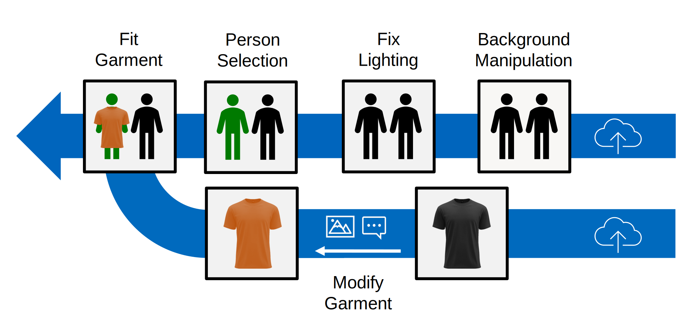

# STYLO-Pipeline: Semantic Transformation of your looks and outfits
Application of Vision Foundation Models for image editing and Virtual Try-On (VITON).

## Pipeline Architecture

## Pipeline Components
We utilize several publicly available image editing models like:
- [x] Background Manipulation: Yahoo's diffusion model [photo-background-generation](https://github.com/yahoo/photo-background-generation.git) 
- [ ] Fix Lighting:
- [ ] Person Selection: Meta's semantic segmentation model [sam2](https://github.com/facebookresearch/sam2) 
- [x] Fit Garment: KAIST Research Group, South Korea VITON model [StableVITON](https://github.com/rlawjdghek/StableVITON)
